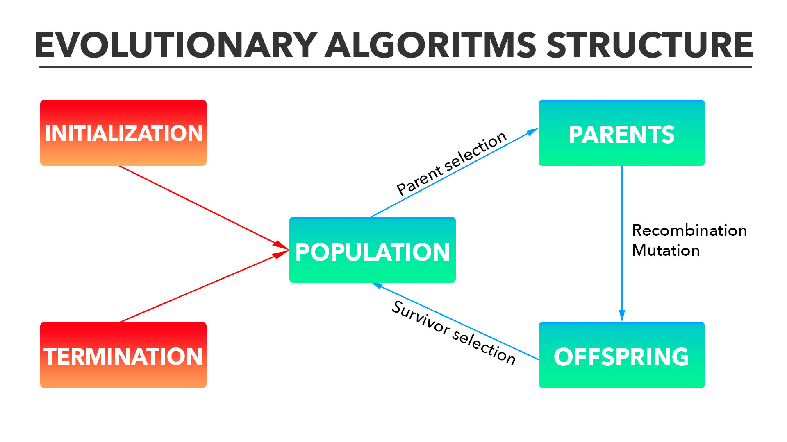

<h1 align="center">
  
</h1>

<h4 align="center">
  Evolutionary algorithms library for the web.
</h4>

<p align="center">
    <a href="https://github.com/CristianAbrante/GeneticsJS/blob/master/LICENSE">
        
    </a>
    <a href="https://circleci.com/gh/CristianAbrante/workflows/GeneticsJS">
        
    </a>
    <a href="https://coveralls.io/github/CristianAbrante/GeneticsJS">
        
    </a>
    <a href="https://github.com/ellerbrock/open-source-badges/">
        
    </a>
    <a href="https://coveralls.io/github/CristianAbrante/GeneticsJS">
        
    </a>
    <a href="https://geneticsjs.wordpress.com/">
        
    </a>
    <a href="https://twitter.com/GeneticsJs">
        
    </a>
</p>

<p align="center">
  <a href="#introduction">Introduction</a> •
  <a href="#installation">Installation</a> •
  <a href="#usage">Usage</a> •
  <a href="#roadmap">Roadmap</a> •
  <a href="#contributing">Contributing</a> •
  <a href="#authors">Authors</a> •
  <a href="#license">License</a>
</p>

## :books: Introduction
Evolutionary computing is one of the main techniques nowadays
for solving complex optimization problems. This library provides 
with the basic structure for implementing the most common evolutionary
algorithms, such as **genetic algorithms**.

<p align="center">
    
</p>

> Evolutionary algorithms basic structure

Evolutionary algorithms are composed basically by four elements:

* **Individuals**: Represent possible solutions of our problem in a determinate search space.
* **Mutation**: Mutation operator alterates one individual.
* **Recombination**: Recombination operator takes two parents and creates the offspring.
* **Parent selection**: Selection of the *best* parents that are going to be reproduced in the next generation.
* **Survivor selection**: Selection of the offspring and parents that are going to be the next generation.
 
This framework is going to provide the most common techniques for each component.

## :wrench: Installation
Currently project is **under development (no stable version released :warning:)**, but it is going to be installed
through npm:

```
npm install genetics-js
```

## 🧬 Usage
No major versions have been released, so only **Individuals** creation is implemented:
```typescript
import Genetics from 'genetics-js';
const { BinaryIndividual } = Genetics.individual;

let individual = new BinaryIndividual('001100');
individual.genotype // [false, false, true, true, false, false]
```

## :stars: Roadmap
The roadmap is strictly determined by the operations that are going to be 
implemented:

- [x] `v0.1.0`: Implementation of **individuals**.
- [ ] `v0.2.0`: Implementation of **mutation operators**.
- [ ] `v0.3.0`: Implementation of **recombination operators**.
- [ ] `v0.4.0`: Implementation of **parent selection methods**.
- [ ] `v0.5.0`: Implementation of **survivor selection methods**.
- [ ] `v0.6.0`: Implementation of **population and offspring management**.
- [ ] `v0.7.0`: Implementation of **common evolutionary algorithms** with fixed configurations.

## :open_hands: Contributing
You can report a bug, or request a feature with an issue:

* [Report a bug :bug: with this template.](https://github.com/CristianAbrante/GeneticsJS/issues/new?assignees=&labels=&template=bug-report.md&title=%3Abug%3A).
* [Request a feature :bulb: with this template.](https://github.com/CristianAbrante/GeneticsJS/issues/new?assignees=&labels=&template=feature_request.md&title=)

Any help would be welcome :smile:.

## :muscle: Authors
* **Cristian Abrante** - [CristianAbrante](https://github.com/CristianAbrante) - ([cristian@abrante.me])

## :memo: License
This project is licensed under the **[MIT License](https://github.com/CristianAbrante/GeneticsJS/blob/master/LICENSE)**